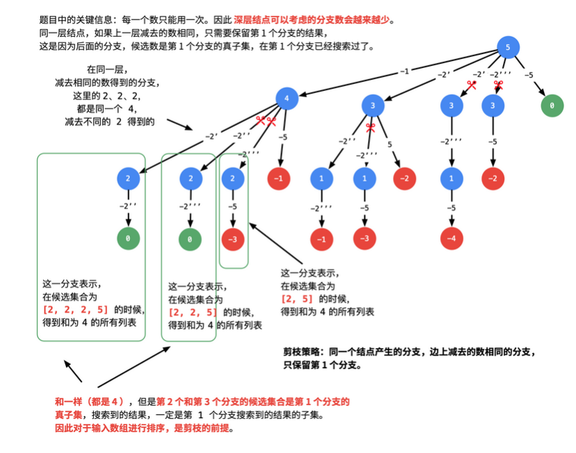

# 回溯模板 + 剪枝

回溯算法是在一棵树上的 **深度优先遍历**（**因为要找所有的解，所以需要遍历**）；

例题：包括组合、排列、子集等题型

----------

### 举例组合问题：

## [77. 组合](https://leetcode-cn.com/problems/combinations/)             

[大佬讲解](https://leetcode-cn.com/problems/combinations/solution/hui-su-suan-fa-jian-zhi-python-dai-ma-java-dai-ma-/)

给定两个整数 *n* 和 *k*，返回 1 ... *n* 中所有可能的 *k* 个数的组合。

**示例:**

```
输入: n = 4, k = 2
输出:
[
  [2,4],
  [3,4],
  [2,3],
  [1,2],
  [1,3],
  [1,4],
]
```

### 分析

既然是树形问题上的 深度优先遍历，因此首先画出树形结构。例如输入：n = 4, k = 2，我们可以发现如下递归结构：

- 如果组合里有 1 ，那么需要在 [2, 3, 4] 里再找 1 个数；
- 如果组合里有 2 ，那么需要在 [3, 4] 里再找 1 数。注意：这里不能再考虑 1，因为包含 1 的组合，在第 1 种情况中已经包含。

依次类推（后面部分省略），以上描述体现的 递归 结构是：在以 nnn 结尾的候选数组里，选出若干个元素。画出递归结构如下图：


### demo_1

```java
class Solution {
    public List<List<Integer>> combine(int n, int k) {
        List<List<Integer>> res = new LinkedList<>();

        if (n == 0 || k <= 0 || k > n) {
            return res;
        } 

        List<Integer> path = new LinkedList<>();
        backTrace(n, k, 1, path, res);

        return res;
    }

    private void backTrace(int n, int k, int begin, List<Integer> path, List<List<Integer>> res) {
        // 结束条件 base
        if (path.size() == k) {
            res.add(path);
            return;
        }

        // 原版本
        for (int i = begin; i <= n ; i++) {
            path.add(i);
            backTrace(n, k, begin + 1, path, res);
            path.remove(path.size() - 1);
        }
    }
}
```

### 优化：分析搜索起点的上界进行剪枝

```java
        // 原版本
        for (int i = begin; i <= n ; i++) {
            path.add(i);
            backTrace(n, k, begin + 1, path, res);
            path.remove(path.size() - 1);
        }
```

事实上，如果 n = 7, k = 4，从 5 开始搜索就已经没有意义了，这是因为：即使把 5 选上，后面的数只有 6 和 7，一共就 3 个候选数，凑不出 4 个数的组合。因此，搜索起点有上界，这个上界是多少，可以举几个例子分析。

分析搜索起点的上界，其实是在深度优先遍历的过程中剪枝，剪枝可以避免不必要的遍历，剪枝剪得好，可以大幅度节约算法的执行时间。

剪枝如下：

```java
        // 搜索起点的上界 + 接下来要选择的元素个数 - 1 = n
        // 接下来要选择的元素个数 = k - path.size()
        // ----> 搜索起点的上界 = n - (k - path.size()) + 1
        for (int i = begin; i <= (n - (k - path.size()) + 1); i++) {
            path.add(i);
            backTrace(n, k, i + 1, path, res);

            path.remove(path.size() - 1);
        }
```

### demo_2

```java
class Solution {
    public List<List<Integer>> combine(int n, int k) {
        List<List<Integer>> res = new LinkedList<>();

        if (n == 0 || k <= 0 || k > n) {
            return res;
        } 

        List<Integer> path = new LinkedList<>();
        backTrace(n, k, 1, path, res);

        return res;
    }

    private void backTrace(int n, int k, int begin, List<Integer> path, List<List<Integer>> res) {
        if (path.size() == k) {
            res.add(path);
            return;
        }

        // // 原版本
        // for (int i = begin; i <= n ; i++) {
        //     path.add(i);
        //     backTrace(n, k, begin + 1, path, res);
        //     path.remove(path.size() - 1);
        // }

        // 搜索起点的上界 + 接下来要选择的元素个数 - 1 = n
        // 接下来要选择的元素个数 = k - path.size()
        // ----> 搜索起点的上界 = n - (k - path.size()) + 1
        for (int i = begin; i <= (n - (k - path.size()) + 1); i++) {
            path.add(i);
            backTrace(n, k, i + 1, path, res);

            path.remove(path.size() - 1);
        }
    }
}
```


### 对待含有重复数字的题目

##  [40. 组合总和 II](https://leetcode-cn.com/problems/combination-sum-ii/)  

给定一个数组 `candidates` 和一个目标数 `target` ，找出 `candidates` 中所有可以使数字和为 `target` 的组合。

`candidates` 中的每个数字在每个组合中只能使用一次。

**说明：**

- 所有数字（包括目标数）都是正整数。
- 解集不能包含重复的组合。 

**示例 1:**

```
输入: candidates = [10,1,2,7,6,1,5], target = 8,
所求解集为:
[
  [1, 7],
  [1, 2, 5],
  [2, 6],
  [1, 1, 6]
]
```

**示例 2:**

```
输入: candidates = [2,5,2,1,2], target = 5,
所求解集为:
[
  [1,2,2],
  [5]
]
```


同一层节点，如果上一个分支和当前分支删除的数相同，那么只保留上一个分支即可



```java
dfs() {
    ...
// i 表示的正是同一层的分支所要减去的数
        for (int i = begin; i < candidates.length; i++) {
            // 若升序排序后， 之后的都已经小于 0 了，那么就没必要再继续了
            if (target - candidates[i] < 0) {
                return;
            }

            // 同一层节点，如果上一个分支和当前分支删除的数相同，那么只保留上一个分支即可
            if (i > begin && candidates[i] == candidates[i-1]) {
                continue;
            }
            path.add(candidates[i]);
            dfs(candidates, target - candidates[i], i + 1, res, path);

            path.remove(path.size() - 1);
        }
    ...
}
```

