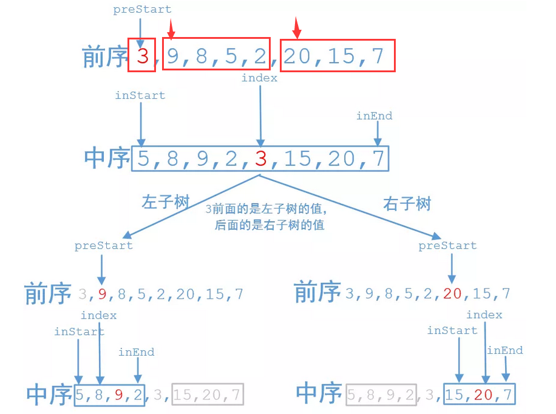

[剑指 Offer 07. 重建二叉树](https://leetcode-cn.com/problems/zhong-jian-er-cha-shu-lcof/)


输入某二叉树的前序遍历和中序遍历的结果，请重建该二叉树。假设输入的前序遍历和中序遍历的结果中都不含重复的数字。

例如，给出

```
前序遍历 preorder = [3,9,20,15,7]
中序遍历 inorder = [9,3,15,20,7]
```

返回如下的二叉树：

```
    3
   / \
  9  20
    /  \
   15   7
```


- 前序：根左右
- 中序：左根右

这里只要找到了前序遍历的结点在中序遍历的位置，我们就可以把中序遍历数组分解为两部分了。

采用 `HashMap`来保存中序中元素的位置，以找到前序中左子树的根节点和右子树的根节点位置

- 根节点位置：`prePos `
- 左子树根节点位置：`prePos + 1`
- 右子树根节点位置：`prePos + treeSize + 1`



采用函数 ` buildTree ` 递归通过中序和先序得到

- 左子树需要中序的最左侧和中序当前点的左边点

- 右子树需要中序最右侧和中序当前点的右边点

- 当前点在中序中的位置，由 之前的 `HashMap ——> mapInOrder`  得到

- ```java
          int inPos = mapInOrder.get(preorder[prePos]);
  ```

prePos 表示先序的第 pos 个， inLeftL 表示中序的最左侧， inRightR表示中序的最右侧

```java
    private TreeNode buildTree(int[] preorder, int[] inorder, int prePos, int inLeftL, int inRightR) {
        ...
	rootNode.left = buildTree(preorder, inorder, prePos+1, inLeftL, inPos-1);
	rootNode.right = buildTree(preorder, inorder, prePos + treeSize + 1, inPos+1, inRightR);
        return rootNode;
    }
```

值得注意的是，进行递归遍历时，右子树的根节点位置取决于左子树的 size ，因此需要计算得到左子树的位置 ` prePos + treeSize + 1 `

而左子树的 size 由 ` 当前根节点在中序中的位置 - 根节点左子树的中序最左侧位置 `


代码如下

```java
class Solution {
    // post 标记范围
    // 存放中序中各点的位置， 用来找到左右子树范围
    HashMap<Integer, Integer> mapInOrder = new HashMap<>();

    public TreeNode buildTree(int[] preorder, int[] inorder) {
        // 建立遍历中序到的当前值在先序中的位置
        // 这是由于不含重复数字
        for (int i = 0; i < inorder.length; i++) {
            mapInOrder.put(inorder[i], i);
        }

        return buildTree(preorder, inorder, 0, 0, inorder.length - 1);

    }    

    // prePos 表示先序的第 pos 个， inLeftL 表示中序的最左侧， inRightR表示中序的最右侧
    private TreeNode buildTree(int[] preorder, int[] inorder, int prePos, int inLeftL, int inRightR) {
        if(inLeftL > inRightR) {
            return null;
        }

        int inPos = mapInOrder.get(preorder[prePos]);
        TreeNode rootNode = new TreeNode(inorder[inPos]);
        int treeSize = inPos - inLeftL;

        rootNode.left = buildTree(preorder, inorder, prePos+1, inLeftL, inPos-1);
        rootNode.right = buildTree(preorder, inorder, prePos + treeSize + 1, inPos+1, inRightR);
    
        return rootNode;
    }    

}
```

