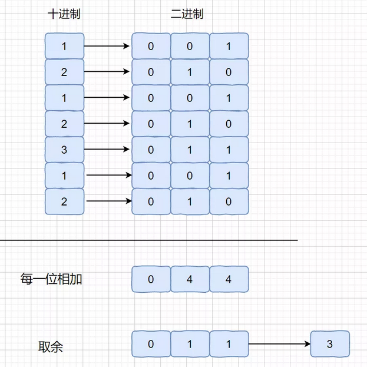

### No.137 只出现一次的数Ⅱ

[Single Number II](https://leetcode.com/problems/single-number-ii/description/)

给定一个非空整数数组，除了某个元素只出现一次以外，其余每个元素均出现了三次。找出那个只出现了一次的元素。

示例 1:

> 输入: [2,2,3,2] 输出: 3


### 法一、求和法

（SumSet  *  3  -  SumNum）/ 2即可，除以 2 是因为我们减去之后得到的是 2 倍的目标元素。

注：这个题目中需要注意溢出的情况 。

```java
    // 注意超界
    public int singleNumber_1(int[] nums) {
        Set<Integer> set = new HashSet<>();

        // 对 数组 和 set 分别就和，两倍的差值为所求值
        long numSum = 0;
        long setSum = 0;
        for(int i:nums) {
            if(!set.contains(i)) {
                set.add(i);
                setSum += i;
            }
            numSum += i;
        }

        return (int)((setSum * 3 - numSum) / 2);
    }
```


### 法二、位运算法

将所有数的位数都加起来， 对 3 求余， 单独的那个数，其位数加上其他所有取余后，必然不为 3 的倍数



如上图，可知，对位数进行加法，取余后构成单独数的位数组成

> 值得注意！！！取每一位时，进行移位操作应记住打括号！！移位的运算级小于 + 

```java
    public int singleNumber(int[] nums) {
        if(nums.length == 1) {
            return nums[0];
        }
        // 共 32位
        int res = 0;
        for (int i = 0; i < 32; i++) {
            int curBitVal = 0;
            for (int j = 0; j < nums.length; j++) {
                // if((nums[j] & (1 << i)) >= 1) {// 值得注意 此处不能这样
                // [-2,-2,1,1,-3,1,-3,-3,-4,-2]  就是上面行错的原因， 可以为 负数！！
                if(((nums[j] >> i) & 1) == 1){
                    curBitVal += 1;// 得到该数的位    
                }
                
            }
            if(curBitVal % 3 != 0){// 对 3 取余
                res |= (1 << i);    
            }
        }// 至此 得到 32 位的最终结果
        return res;
    }
```

