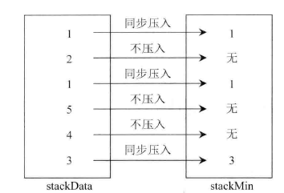
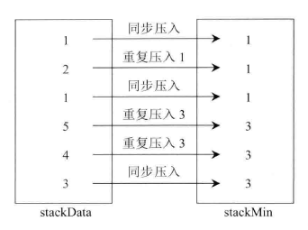

### No.155 最小栈

  [Min Stack](https://leetcode.com/problems/min-stack/)


【解答】

### 法一：

​	1.push ：安放两个栈data栈 & Min栈，data 用于基本操作， min 用于存储每一步最小值，若没有 Min 的栈顶小，则不存入。

​	注意！记住相等时也要压入

```
if(help.isEmpty() || pushNum <= help.peek())
	help.push(pushNum);
```



​	2.pop： 在 data 栈 pop 时，和 MIn 栈顶进行判断，若 data 的 pop 数据大于Min栈顶时，MIn 栈顶不进行修改，若等于曾将栈顶一并弹出。

​	3. getmin： 直接查询 Min 栈顶

### 	法二：

​	与法一最大的区别就是，若没有 Min 栈顶小，则重复存入。



**对比：** 法一 Min 进行push 时省空间，但弹出时稍微费时间（需要判断是否为最小值）；而 法二直接弹出当前值即可，但是在 push 时需要进行判断大小。

```java
class MinStack {

    // 采用两个栈进行操作， 一个为普通栈， 一个为存最小值栈
    Stack<Integer> stack = null;
    Stack<Integer> storeStack = null;
	public MinStack() {
        stack = new Stack<>();
        storeStack = new Stack<>();
    }

    public void push(int x) {
        stack.push(x);
        if (storeStack.isEmpty() || x <= getMin()) {
            storeStack.push(x);
        }
    }

    public void pop() {
        int popValue = stack.pop();
        if (popValue == getMin()) {
            storeStack.pop();
        }
    }

    public int top() {
        return stack.peek();
    }

    public int getMin() {
        return storeStack.peek();
    }
}
```


