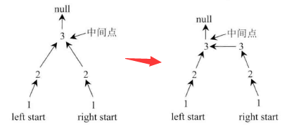

### 回文链表

[Palindrome Linked List](https://leetcode.com/problems/palindrome-linked-list/)


### 法一 全部压入栈

压入栈后， 再进行一次遍历，每次与弹出栈顶进行对比。

```java
    public boolean isPalindrome_1(ListNode head) {
        // 采用栈 
        // 进行翻转后判断, 
        if(head == null) {
            return true;
        }
        ListNode cur = head;
        Deque<Integer> stack = new LinkedList<>();
        while(cur != null) {
            stack.push(cur.val);
            cur = cur.next;
        }
        // 此时 stack 中逆序放置， 现在进行对比判断
        cur = head;
        while(!stack.isEmpty()) {
            if(stack.pop() != cur.val) {
                return false;
            }
            cur = cur.next;
        }
        return true;
    }
```


### 法二 右半部分压入栈

采用快慢指针， 那么慢指针便会位于对称轴两侧或者对称轴上 。

此时将 慢指针 后面部分（即右半部分）压栈，再对链表进行一次遍历，进行对比。

```java
    // 快慢指针。 压入右半部分
    public boolean isPalindrome_2(ListNode head) {
        if(head == null || head.next == null) {
            return true;
        }
        ListNode slow = head;
        ListNode fast = head;
        Deque<Integer> stack = new LinkedList<>();
        while(fast != null && fast.next != null) {
            fast = fast.next.next;
            slow = slow.next;
        }// 至此 slow 位于对称轴两侧或者对称轴上 
        // 压入右半部分后， 再与左半部分进行对比
        while(slow != null) {
            stack.push(slow.val);
            slow = slow.next;
        }// 至此 压入完
        fast = head;
        // 弹出栈中所有点，与左半部分进行对比
        while(!stack.isEmpty()) {
            if(stack.pop() != fast.val) {
                return false;
            }
            fast = fast.next;
        }
        return true;
    }
```


### 法三 对右半部分进行翻转

如下图所示， 将右半部分翻转后，头指针与尾指针同时开始读取判断。



空间复杂度降为 O(1)

```java
    public boolean isPalindrome(ListNode head) {
        if(head == null || head.next == null) {
            return true;
        }
        ListNode slow = head;
        ListNode fast = head;
        while(fast != null && fast.next != null) {
            fast = fast.next.next;
            slow = slow.next;
        }// 至此 slow 位于对称轴两侧或者对称轴上 
        // 进行翻转
        ListNode cur = slow;// slow 保存当前点
        ListNode pre = null;
        ListNode next = null;
        while(cur != null) {
            next = cur.next;
            cur.next = pre;
            pre = cur;
            cur = next;
        }// 至此 pre 指向最后一个点， 
        // 开始从最后一个点开始读
        fast = head;
        cur = pre;
        boolean isTrue = true;
        // 此处是 fast 继续
        while(cur != null && fast != null) {
            if(cur.val != fast.val) {
                isTrue = false;
                break;
            }
            cur = cur.next;
            fast = fast.next;
        }
        // 进行恢复
        cur = pre;
        pre = null;
        while(cur != null) {
            // 此处是翻转
            next = cur.next;
            cur.next = pre;
            pre = cur;
            cur = next;
        }
        pre.next = fast;
        return isTrue;
    }
```

