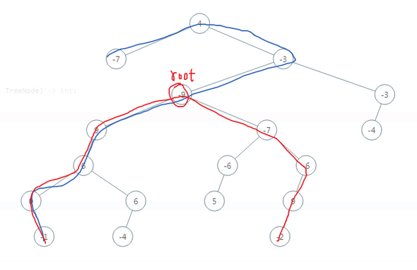

### No.543 二叉树的直径

  [Diameter of Binary Tree](https://leetcode.com/problems/diameter-of-binary-tree/)

给定一棵二叉树，你需要计算它的直径长度。一棵二叉树的直径长度是任意两个结点路径长度中的最大值。这条路径可能穿过也可能不穿过根结点。

给定二叉树

          1
         / \
        2   3
       / \     
      4   5    

返回 3, 它的长度是路径 [4,2,1,3] 或者 [5,2,1,3]。


首先需要明白，最大路径不一定为 根节点



### 实则是求深度

[Maximum Depth of Binary Tree](https://leetcode.com/problems/maximum-depth-of-binary-tree/description/)        [Java](./algorithms/java/104.maximumDepthOfBinaryTree)

对所有节点进行遍历（递归——后序遍历），通过一个全局变量记录路径最大值

在对当前节点 root 的左右子树求分别深度基础上，加上自身的 1 个点。（ l+r+1 ）

```java
    private int maxLevel = 0;
	public int diameterOfBinaryTree(TreeNode root) {
        if(root == null) {
            return 0;
        }

        levelTree(root);
        
        return maxLevel;
    }

    // 就是算深度
    private int levelTree(TreeNode root) {
        if(root == null) {
            return 0;
        }
        
        int leftLevel = levelTree(root.left);
        int rightLevel = levelTree(root.right);
        maxLevel = Math.max(leftLevel + rightLevel, maxLevel);

        return Math.max(leftLevel, rightLevel) + 1;
    }
```

对比求深度函数，其实就是采用一个 maxLevel 用于记录。