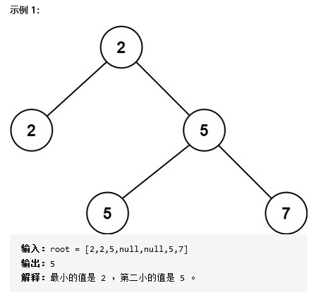

### No.671 二叉树中第二小的节点

[Second Minimum Node In a Binary Tree](https://leetcode.com/problems/second-minimum-node-in-a-binary-tree/description/)

给定一个非空特殊的二叉树，每个节点都是正数，并且每个节点的子节点数量只能为 2 或 0。如果一个节点有两个子节点的话，那么该节点的值等于两个子节点中较小的一个。

更正式地说，root.val = min(root.left.val, root.right.val) 总成立。

给出这样的一个二叉树，你需要输出所有节点中的第二小的值。如果第二小的值不存在的话，输出 -1 。

 

### 1、 暴力

采用小根堆，并通过 set 来确保值的加入，以保证第二小为不重复值。

```java
    PriorityQueue<Integer> heap = new PriorityQueue<>();
    Set<Integer> set = new HashSet<>();
    public int findSecondMinimumValue_1(TreeNode root) {
        
        if(root == null) {
            return 0;
        }
        // 叶子节点返回 -1
        if(root.left == null && root.right == null) {
            return -1;
        }
        traverse(root);
        if(heap.size() == 1) {
            return -1;
        }
        // 至此 表示存在
        heap.poll();
        return heap.poll();
        
    }

    private void traverse(TreeNode root) {
        if(root == null) {
            return;
        }
        if(!set.contains(root.val)) {
            set.add(root.val);
            heap.add(root.val);    
        }
        
        traverse(root.left);
        traverse(root.right);
    }
```


### 2、递归


找到和 rootValue 值不相同的最小值，与 rootValue 不相同的最小值其实就是第二小的值。

本题的二叉树有两点性质 1.所有节点的值都为正数 2.每个节点的值 == 左右子节点中较小的值 -->根节点值一定最小-->子节点的值【大于等于】父节点。

```java
    public int findSecondMinimumValue(TreeNode root) {
        if(root == null) {
            return -1;
        }
        // 叶子节点返回 -1
        if(root.left == null && root.right == null) {
            return -1;
        }
        // 找出候选数，默认就是子节点值，如果子节点值和root值相同，递归，在子树中寻找候选数
        int left = root.left.val;
        int right = root.right.val;
        // 进入相等数递归，并非返回它，而是进入，并不会返回相等值。
        if(left == root.val) {
            left = findSecondMinimumValue(root.left);
        }
        if(right == root.val) {
            right = findSecondMinimumValue(root.right);
        }
        // 如果左右候选数都正常，返回较小值就可
        if(left != -1 && right != -1) {
            return Math.min(left, right);
        }
        // 至此表示至少一个为 -1， 说明整个子树中没有可供候选的数
        if(left != -1) {
            return left;
        } 
        return right;
        
    }
```

再思考一下 findSecondMinimumValue()，它的功能是，输入一个二叉树的节点 node ，返回【以这个节点 node 为根节点的子树】中第二小的值。

```java
if(left != -1 && right != -1){
    // 首先 left right 不可能为 root，因为遇到相等时是进入，而非返回
    //什么时候left == -1 ？ root.left 为根节点的子树的节点值全部相同，且root.left.val==root.val。那么自然这颗子树没有第二小的节点。（全部进入递归，得到 -1）
    //什么时候left != -1 ? root.left 为根节点的子树中有node.val【大于】root.val的节点。
    	//left是【以root.left为根节点的子树==左子树】中第二的值，该值【大于】root.val
    	//right是【以root.right为根节点的子树==右子树】中第二的值，该值【大于】root.val
    	//在 left、right 中选出最小的，就是
    return Math.min(left, right);
}
```

