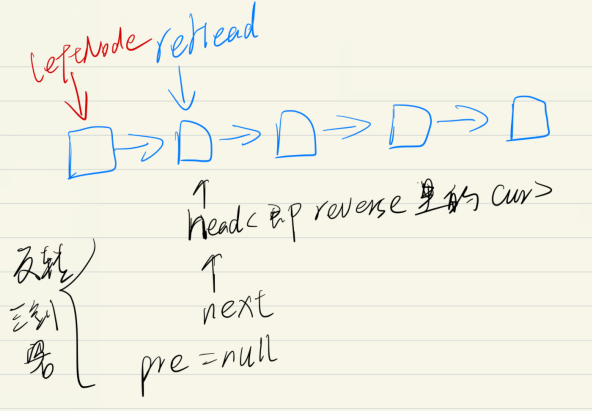
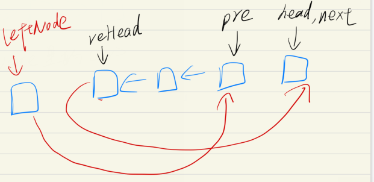

### No.92 反转链表ii

[Reverse Linked List II](https://leetcode.com/problems/reverse-linked-list-ii/description/)

### 采用快慢指针

首先

1. 首先设立预先指针 headFirst

> **使用预先指针的目的在于链表初始化时无可用节点值，而且链表构造过程需要指针移动，进而会导致头指针丢失，无法返回结果。**

2. 我们定义两个指针，分别称之为 leftNode  和 。
   我们首先根据方法的参数m确定g和p的位置。

   将 leftNode 移动到第一个要反转的节点的前面，将 移动到第一个要反转的节点的位置上。我们以m=2，n=4为例。

3. 采用 cnt 来记录当前位置，首先指向 m， 找到反转的前一个， 再移动到 m 处。（就不要用 while 了， 绕的晕）

4. 下图展示

   在到达反转时， 两个 ListNode 进行保存地址

   

5. 反转后如图

   

最后返回头结点后面点。

```java
class Solution {
    public ListNode reverseBetween(ListNode head, int m, int n) {
        if(m == n || head == null) {
            return head;
        }
        ListNode headFirst = new ListNode(0);// 头结点
        headFirst.next = head;

        // head = pre;
        ListNode leftNode = headFirst;

        // 移动 m-1 步到反转的前一个
        int cnt = 1;
        for (; cnt < m; cnt++) {
            leftNode = leftNode.next;
        } // 至此 leftNode 指向交换的前一个 cnt = m

        head = leftNode.next;
        ListNode reHead = head; // 用 reHead 记录交换的第一个
        ListNode next = head;
        ListNode pre = null;

        for (; cnt <= n; cnt++) {
            next = head.next;
            head.next = pre;
            pre = head;
            head = next;
        }
        // 至此 已经到达 head 交换点右侧 , pre 指向 m 处点
        leftNode.next = pre;
        reHead.next = next;

        return headFirst.next;
    }

}
```

